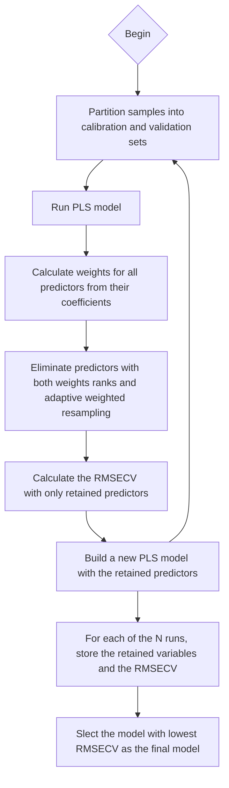

# Competitive adaptive reweighted sampling (CARS)

CARS is a variable selection feature that [has been developed](https://doi.org/10.1016/j.aca.2009.06.046) mainly for high-dimensional data where full models performed sub-optimally. The basic principle is to use Monte Carlo sampling runs to iteratively modulate the subsets of features (e.g., wavelengths) to be included in the final model. It is more complex/flexible than traditional implementations of iPLS, where forward or backward selection procedures for given inflexible intervals are undertaken. 

This technique add to the many more that have been developed to conduct feature selection in high-dimensionality systems, for example: 

1. Genetic algorithms
2. [Uninformative variable elimination](https://doi.org/10.1016/j.chemolab.2007.11.005)
3. [Variable importance projection](https://doi.org/10.1002/cem.2736)
4. [Particle swarm optimization](https://doi.org/10.1016/S0020-0190(02)00447-7)
5. [Interval combination optimization](https://doi.org/10.1016/j.aca.2016.10.041), and Song et al. 2016 describe very usefully other methods such as VISSA-iPLS or GA-PLS!
6. etc.

All these techniques have been demonstrated to improve PLS model performance over full models (with no filtering of "uninformative" wavelengths) in spectranomics. In CARS, the optimization in one that maximizes the performance of the **calibration model**, generally being assessed through RMSECV:

$$ RMSECV = \sqrt{\sum(y_i - \hat{y}_i)^2 \over n}$$

with :

$y_i$ = actual value of $y$

$\hat{y}_i$ = predicted value of $y$ by the calibration model

$n$ = number of observations in the model (samples included in the calibration set)

<br>
<br>

## Why adaptive?
_______________

CARS is labeled as a method for "adaptive" sampling because in a way, it is somewhat analogous to Darwin's selection theory, that is, most important predictors are gradually "surviving" the feature selection process.

<br>
<br>

## What are the weights referring to?
-----
Although PLS models link $Y$ (response variable) to $X$ (predictors) through the intermediate of latent variables (LVs), in the end the model attributes coefficients to all predictors, so it can be written in the simplified form:

$$Y=Xb + \epsilon$$

where 

$b$ is the vector of coefficients attributed to all predictors in matrix $X$

$\epsilon$ are model's residuals (errors)

The very spirit of CARS is to very intuitively weight predictors in $X$ such that the weight ($w$) of a predictor $x$ can be defined as:

$$w_i=\frac{|b_i|}{\sum_{i=1}^{p}|b_i|}$$

where

$p$ is the total number of predictors in $X$

The very idea of CARS will be to iteratively eliminate predictors with low weight $w$.

<br>
<br>

## How much predictors are eliminated at every step?
----------
The process is not haphazard, but rather dynamic over time and consists of two sequential steps:

>1. Remove predictors with lowest weights by force 
>
>2. Further remove additional predictors by making a weighted draw with the remaining predictors (after step 1) with weights being the $w$ coefficients themselves

For the initial removal "by force" of predictors with lowest weights, the number to remove at step $i$ is determined by the following exponential decay:

$$r_i = ae^{-ki}$$

where

$r_i$ = proportion of predictors from $X$ to be kept at step $i$

$a$ and $k$ are constants:

$a=\left( p \over 2\right)^{1/(N-1)}$ , $N$ being the number of iterations to run for the CARS procedure

$k=\frac{\ln(p/2)}{N-1}$

$a$ and $k$ are ajusted based on the number of predictors and the number of steps to ensure some kind of comparability when using CARS in different datasets and with distinct numbers of iterations, to ensure that the two phases (first with fast decay in number of kept predictors from $X$ and second more selective phase where predictors are removed with parsimony) are well represented.

The second elimination process is one of weighted resampling of the remaining predictors. Basically just a random draw with replacement, using weights $w$ to determine probability of being drawn (retained) for each remaining predictors. At a given time step $i$, the number of draws will be equal to the remaining predictors, so $p \times r_i$. Any predictor that would not get drawn once during these draws at step $i$ would be removed from the dataset.

<br>
<br>

## How does the algorithm work?
-------------




<br>
<br>

## Implementation in R
-----------

First, let's load appropriate package and retrieve some test dataset (``NIRsoil``). We can partition this dataset into a calibration and a validation set according to a given $p$ ratio. Here, we go with  $p=0.8$, meaning that 80% of the dataset will go to model calibration, and 20% will go to validation. For convenience, speed and simplicity, we here go with a random allocation of samples to training vs. testing, but in a real analysis, we might want to opt for a better approach that ensures a proper representation of the inter-sample variability in **both** the training and validation sets, such as the Kennard-Stone algorithm, or the conditioned Latin Hypercube Sampling (cHLS). We also specify a pls model with $n=10$ components. This can be further explored with your own data...
```R
rm(list=ls())
library(pls)
library(prospectr)
data(NIRsoil)

### X are soil spectra
X=NIRsoil$spc

### Y are soil C content
Y=NIRsoil$Ciso

### Keep only those samples for which C data is available
X=X[!is.na(Y),]
Y=Y[!is.na(Y)]

### Determine a proportion of samples to go towards training/calibration
p=.8
train=sample(c(rep(1,ceiling(p*length(Y))),rep(0,length(Y)-ceiling(p*length(Y)))),length(Y),replace=F)==1

### Build a pls model (here with n=10 components)
ncomp=10
calib=plsr(Y~X,ncomp=ncomp,subset=train,validation="none")

### Predict, from this calibration models, Y values for the spectra not included in the calibration model (i.e., validate the model)
pred=predict(calib,X[!train,])

### Define a RMSE function to calculate the RMSE on the validation set
RMSE=function(pred,real){
	sqrt(sum((pred-real)^2)/length(real))}

rmsecv=RMSE(Y[!train],pred[,,ncomp])

temp=numeric(ncomp)
for(i in 1:ncomp){temp[i]=RMSE(Y[!train],pred[,,i])}

plot(temp~c(1:ncomp))


### in progress..................

```